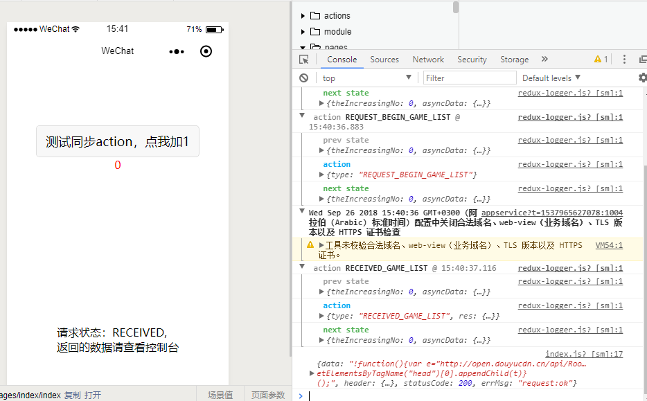

> 本文主要讲述，在微信小程序中如何使用redux

[DEMO](https://github.com/tornoda/miniProgram-with-redux)

## 需要解决的问题

1. 如何在小程序中引入redux状态管理库，及它相关的插件？
2. 微信小程序没有清晰的异步api，便于thunkMiddleware处理异步请求（异步操作），如何解决？
3. 如何正确使用store的三大核心方法（`getStore` `dispatch` `subscribe`）？

redux并不是react专属，所以他可以在任何地方使用，小程序也不例外。解决上面三个问题就可以了。

## 问题一： 如何在小程序中引入redux状态管理库，及它相关的插件？

1. 使用`npm`在临时目录里安装`redux`和其他你需要用到的包，如：`logger` `thunkMiddleware`。这里以redux示例。
2. 进入`node_module`中，拷贝如下文件：`\redux\dist\redux.js`或者`\redux\dist\redux.min.js`
3. 根据1/2中的步骤。把`redux.js` `logger.js` `thunkMiddleware`都拷贝到小程序项目文件夹`\module`目录下，没有请新建。

## 问题二： 微信小程序没有清晰的异步api，便于thunkMiddleware处理异步请求（异步操作），如何解决？

前面有文章已经写过，如何将微信异步api转换为Promise，便于异步编程:[把微信小程序异步API转为Promise，简化异步编程](https://www.cnblogs.com/looyulong/p/9471424.html)

读完会，把`to-promise`库和`redux`一样放在`\module`文件夹下

## 问题三：如何正确使用store的三大方法（`getStore` `dispatch` `subscribe`）？

**这也是最关键的**

1. 在`app.js`中创建`store`

```
//app.js
import reducer from './reducer/index'
import { createStore, applyMiddleware } from './module/redux'
import logger from './module/redux-logger'
import thunkMiddleware from './module/redux-thunk'

//创建redux store
export const store = createStore(
  reducer,
  applyMiddleware(
    logger,//用于控制台state调试
    thunkMiddleware//用于处理异步action
  )
)

App({
    //...
})
```

2. 编写`action`

```
// 项目根目录/action/http3Steps.js

export const REQUSET_BEGIN = 'REQUEST_BEGIN'
export const RECEIVED = 'RECEIVED'
export const REQUEST_FAILED = 'REQUEST_FAILED'

//创建三个请求http事务时的状态action，用于处理通用http请求
//1 请求开始；2 收到请求；3 请求失败
export const requestBegin = (requestName) => ({
  type: REQUSET_BEGIN + requestName
})

export const received = (requestName, res) => ({
  type: RECEIVED + requestName,
  res
})

export const requestFailed = (requestName, err) => ({
  type: REQUEST_FAILED + requestName,
  err
})
```

编写索引action:

```
// 项目根目录/action/index.js

import { requestBegin, received, requestFailed } from './http3Steps'
import toPromise from '../module/to-promise'

//微信小程序没有提供Promise版本的异步api
//我封装了一个库，把微信小程序异步api转化为Promise，用于处理redux中的异步action
//项目地址：https://github.com/tornoda/to-promise
//使用方法见blog：https://www.cnblogs.com/looyulong/p/9471424.html
const toPromiseWx = toPromise(wx)
const request = toPromiseWx('request')

//这是一个同步的action
export const INCREASE = 'INCREASE'

export const increase = {
  type: INCREASE
}

//这是一个异步action
//网络请求action
//根据redux官网的介绍，它应该是一个Promise，但是微信小程序没有提供Promise版本的异步api，需要使用上面提到的工具库
export const GAME_LIST = '_GAME_LIST'

export const fetch = (requestName, option) => {
  return (dispatch) => {
    dispatch(requestBegin(requestName))//请求开始，更新state状态
    return request(option)
      .then(
        (res) => { dispatch(received(requestName, res)); return res },//请求成功，把返回的信息在state中更新
        (err) => { dispatch(requestFailed(requestName, err)) }//请求失败，把失败的信息在state中更新
      )
  }
}

```

3. 编写处理action的reducer

```
// 项目根目录/reducer/index.js

import { INCREASE } from '../actions/index'
import { GAME_LIST } from '../actions/index'
import { REQUSET_BEGIN, RECEIVED, REQUEST_END } from '../actions/http3Steps'
import { combineReducers } from "../module/redux";

//这是处理本例子中同步action的reducer
export const disposeIncrease = (state = 0, action) => {
  switch (action.type) {
    case INCREASE:
      console.log('redux is worked')
      return state + 1
    default:
      return state
  }
}

//这是处理本例中异步的reducer
const preState = {}

export const disposeFetch = (state = preState, action) => {
  switch (action.type) {
    case REQUSET_BEGIN + GAME_LIST:
      return {
        ...state,
        status: 'REQUEST_BEGIN',
      }
    case RECEIVED + GAME_LIST:
      return {
        ...state,
        status: 'RECEIVED',
        res: action.res
      }
    case REQUEST_END + GAME_LIST:
      return {
        ...state,
        status: 'REQUEST_END',
        err: action.err
      }
    default:
      return state
  }
}

//按照state的结构组合起来
export default combineReducers({
  theIncreasingNo: disposeIncrease,
  asyncData: disposeFetch
})
```
4. 让state变化时自动更新ui视图

方法很简单，在`page`的`index.js`中的`onLoad`函数里面调用`store.subscribe()`方法监听局部data.

```
  onLoad: function () {
    const _this = this
    //在onLoad函数中订阅state的更新
    //如果state变化，对应ui就会更新
    subscribe(() => {
      const { asyncData: { status }, theIncreasingNo } = getState()
      _this.setData({
        syncData: `
          请求状态：${status}, 
          返回的数据请查看控制台
        `,
        number: theIncreasingNo
      })
    })
  }
```

5. 触发动作，发出action，改变state

```
//index.js
import { store } from '../../app'
import { increase, fetch, GAME_LIST } from '../../actions/index'

const { dispatch, subscribe, getState } = store

Page({
  data: {
    syncData: 'Hello World',
    number: '0',
  },
  onLoad: function () {
    const _this = this
    //发出一个异步action
    dispatch(fetch(GAME_LIST, {
      url: 'http://open.douyucdn.cn/api/RoomApi/game'
    })).then((data) => { console.log(data) })
    //在onLoad函数中订阅state的更新
    //如果state变化，对应ui就会更新
    subscribe(() => {
      const { asyncData: { status }, theIncreasingNo } = getState()
      _this.setData({
        syncData: `
          请求状态：${status}, 
          返回的数据请查看控制台
        `,
        number: theIncreasingNo
      })
    })
  },
  testSyncAction: function () {
    //发出一个同步action
    dispatch(increase)
  }
})
```
如下图：



## 源文件

[DEMO地址](https://github.com/tornoda/miniProgram-with-redux)